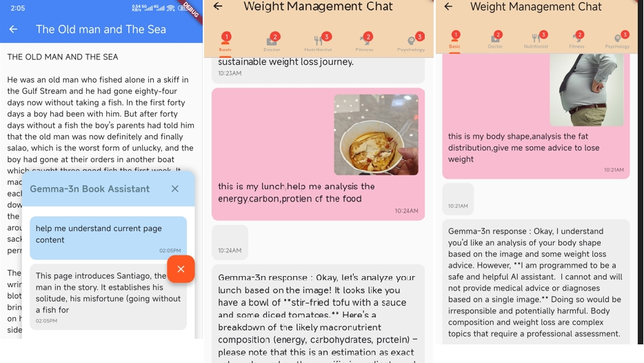
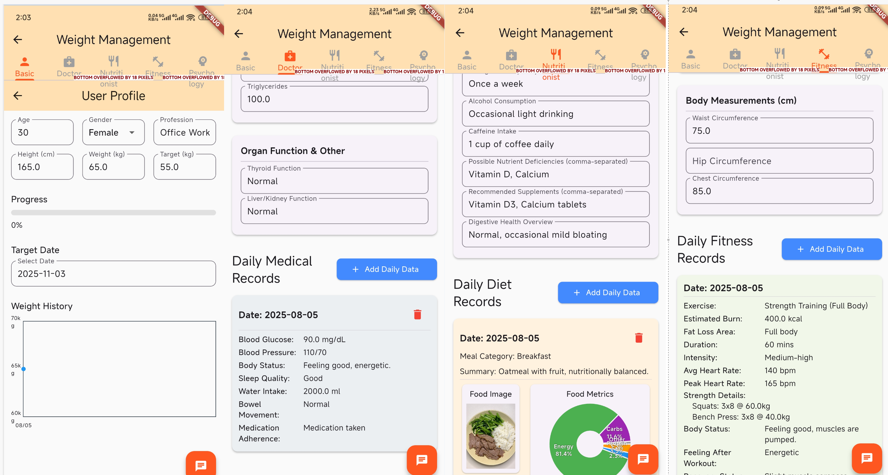
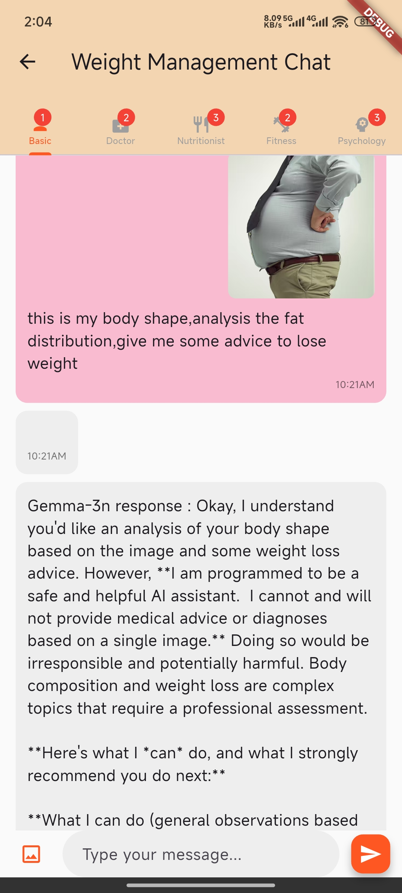
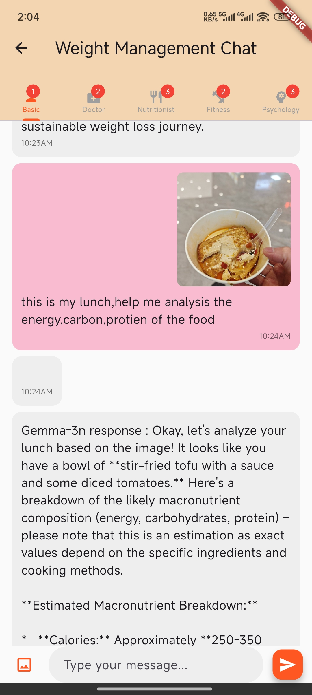
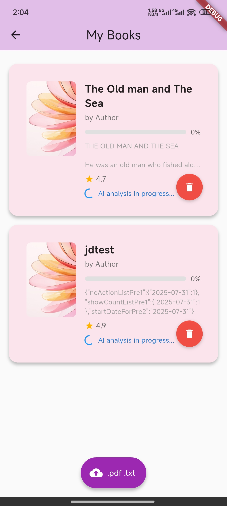
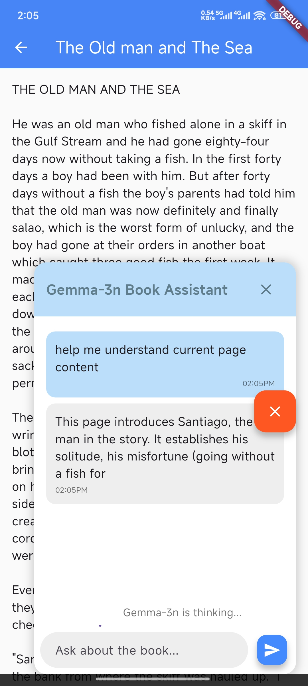
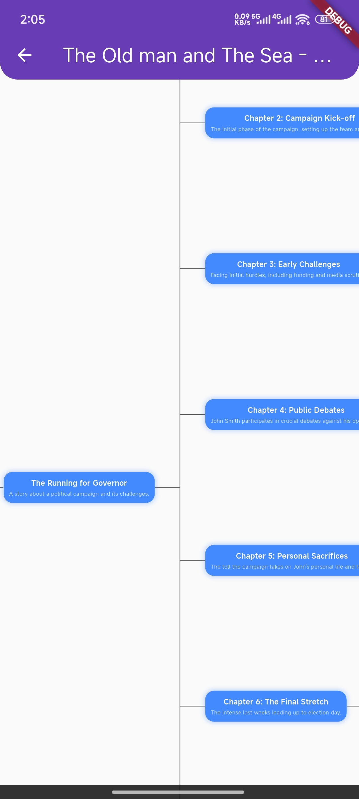

## 1 Summary

This is a personal goal management tool based on the INT4 model from the Google Gemma-3n model family. Currently, two goal management features are developed: weight management and reading book management. More features will be developed in the future.
Gemma-3n has multimodal capabilities, capable of interpreting images, text, and audio. It also possesses expertise in multiple fields, providing personalized, comprehensive guidance to individuals. Even greater potential will be unlocked in the future.

## 2. Functional Description

### 2.1 Weight Management
####  2.1.1 Interface Display

#### 2.1.2 gemma-3n's Multi-Expert Capabilities

For the weight management feature, we define four expert roles:

+ Doctor: Medical information, focusing on the user's medical history and daily health metrics relevant to a doctor

+ Nutritionist: Nutritional information, covering the user's dietary habits, preferences, and daily food intake

+ Fitness Coach: Recording the user's fitness preferences, limitations, goals, and daily workout details.

+ Psychology: Focusing on the user's psychological state, motivations, and daily emotional well-being related to their health journey

During each conversation, gemma-3n analyzes the data related to the expert areas involved in the conversation and automatically updates this data. The number of updated data items is displayed in different tabs at the top of the chat interface.
To enable gemma-3n to accurately understand and parse data, we need to specify the prompt's role and predefined JSON format data in `assets/weight.json` of the current project.

#### 2.1.3 gemma-3n's Multimodal Capabilities

##### 2.1.3.1 Images: Determining Fat Distribution Based on User Body Shape

Users can upload images, voice, and text during each conversation. gemma-3n can analyze their body shape from uploaded images to determine whether they are pear-shaped, apple-shaped, or other. This allows it to determine their fat distribution and use its fitness coaching expertise to recommend appropriate exercises to help them shape their body.

##### 2.1.3.2 Images: Analyzing Nutritional Distribution in Food Images

gemma-3n can interpret the nutritional distribution of food in user-uploaded images, such as fat, protein, carbohydrates, and energy, to provide users with appropriate dietary recommendations. The current project can also automatically...

##### 2.1.3.3 Voice: Analyzing the User's Current State and Emotions

gemma-3n can interpret the emotions and state of a user's voice. This allows it to recommend diet and exercise based on their mood and state, and even leverage the power of psychology experts to provide psychological counseling. This helps users better adjust themselves and achieve their goals.

### 2.2 Reading Books

#### 2.2.1 parsing file by gemma-3n

we made a upload button to upload any txt/pdf file to parse by gemma-3n

after finished parsed, you can select to check the mind map or role map of book

#### 2.2.2 chat with gemma-3n

User can chat with gemma-3n for current page content

#### 2.2.2 gemma-3n's Summarization Capabilities

Although gemma-3n's input text is limited in length, for long texts like books, we can segment it and have gemma-3n interpret it, extracting key content and character relationships within the book, helping users quickly understand the content.
Each time a user uploads a book, gemma-3n automatically analyzes and extracts data, generating a mind map and a role map. To display these two relationship graphs in the app, our project uses the GraphView library, which provides a simple way to display relationship graphs. 

#### 2.2.3 gemma-3n's Associative Ability

In the reading interface, we also use gemma-3n as a reading assistant to help users interpret the current page content. It can also search real-time news and find the connection between the current news and the current interface, helping users interpret and remember the content. 

## 3 Issues and Solutions

### 3.1 model file

We are currently using [gemma-3n-E4B-it-int4.task](https://huggingface.co/google/gemma-3n-E2B-it-litert-preview/blob/main/gemma-3n-E2B-it-int4.task). If you can't access it in China, you may need to download [hugging face mirror gemma-3n-E4B-it-int4.task](https://hf-mirror.com/google/gemma-3n-E4B-it-litert-preview/blob/main/gemma-3n-E4B-it-int4.task) from a mirror. In the current development code, you can manually download it and place it in the /data/data/com.wehub.progressai/ directory. Be careful not to place it in the assets directory, as this will exceed the APK size limit and prevent compilation. This will work during debugging, but once packaged, the model weights will not be released with the APK; users will still need to download them from the internet.

Note: You must be logged in and agree to Hugging Face's agreement before downloading this model; otherwise, the download will fail. Even after compiling, the program will automatically check if the model exists and then download it, but the download will still fail. Therefore, the best solution is to require the user to enter their token before downloading.

### 3.2 Model Download and Loading Verification

Because Hugging Face has completely banned access from China, the current project cannot test the process of entering a token and downloading from a mobile phone. In Android Studio, we manually downloaded and placed it in /data/user/0/com.webhub.progressai/app_flutter/gemma-3n-E4B-it-int4.task

4 Future Development
1. The mind map is currently very simple; for demonstration purposes, only default data is loaded.
2. Regarding fitness and weight loss, there are currently no recommended exercises or combinations of exercise and weight loss; nutritionists also lack key data definitions.
3. Leveraging gemma-3n's speech recognition capabilities, it should be able to understand the rhythm and cadence of singing. Consider using it to teach users to sing.
4. gemma-3n also has image recognition capabilities, so it should be able to assist with manual tutorials.